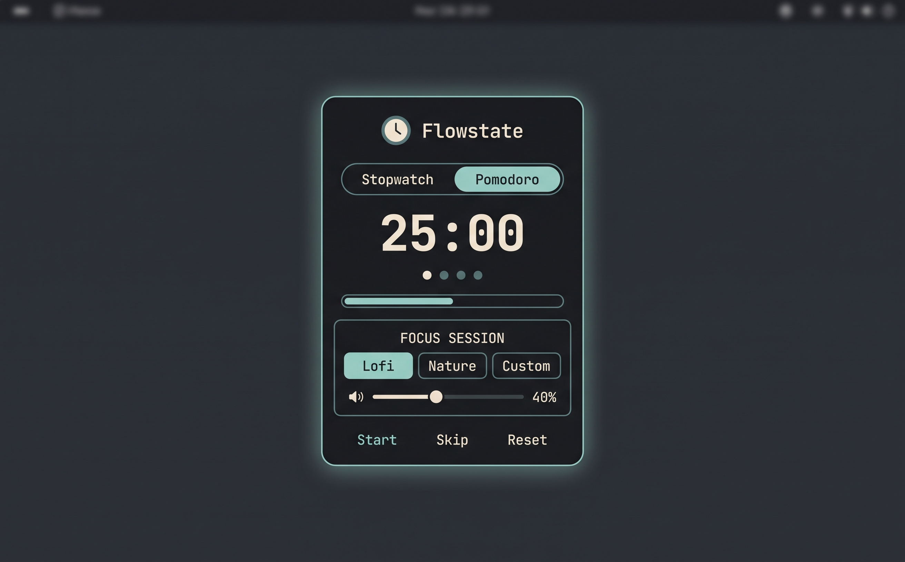

<div align="center">

# 🍅 Flowstate

### A Pomodoro focus timer for the [Omarchy](https://omarchy.org) bar

Start a session and a shuffled Spotify soundtrack plays quietly out of the way —
**pausing itself on every break** and resuming when you're back — while distinct
sounds mark each phase boundary. When the last block finishes, the music stops and
your volume is restored.

[](LICENSE)




</div>

> **A companion to [Flowstate for macOS](https://github.com/keegan-sucks/flowstate-macos)** —
> the two are kept intentionally in step. Same Pomodoro model, same `spotify_player`
> soundtrack (Liked-Songs shuffle, random start), same phase sounds.

---

## Contents

- [What it does](#what-it-does)
- [Requirements](#requirements)
- [Install](#install)
- [Usage](#usage)
- [Soundtracks](#soundtracks)
- [Phase sounds](#phase-sounds)
- [Settings reference](#settings-reference)
- [Scripting (IPC)](#scripting-ipc)
- [Uninstall](#uninstall)
- [License](#license)

---

## What it does

The bar shows a live focus glyph, round dots, and the clock — e.g. `⌖ ●●○○ 12:34`.
Start a session and Flowstate runs a **Pomodoro cycle**:

> focus 1 → short break → focus 2 → short break → … → focus `N`, then it **ends**.

There is **no timed long break** — after the last focus block the session finishes
with a distinct chime; take your break whenever you like.

While a session runs, the **soundtrack** (via [`spotify_player`](https://github.com/aome510/spotify-player)):

- starts shuffled, on a **random track**, ducked to a quiet focus volume, on a far-off
  workspace (default **9**);
- **pauses during each short break** and **resumes** when focus returns;
- at the end, **restores your previous volume and pauses** (the player is left open).

Your **Liked Songs** work as a soundtrack (shuffled) — something the official Spotify
Linux client can't do. Prefer just the timer? Turn **Play soundtrack** off.

The widget lives in the bar and **follows your Omarchy theme automatically**.

---

## Requirements

| Dependency | Why | Notes |
|---|---|---|
| **Omarchy** (Quickshell shell + Hyprland) | Host for the bar widget | Already present on Omarchy |
| [`spotify_player`](https://github.com/aome510/spotify-player) | Soundtrack playback, shuffle, Liked Songs, volume | AUR · **Spotify Premium required** |
| `hyprctl` + `jq` | Move the player to its workspace | `jq` from the repos |
| `pactl` / `pw-play` | Phase-boundary sounds | Ships with Omarchy's audio stack |

`spotify_player` is installed for you by the setup script below (Premium + a one-time
`authenticate` are on you).

---

## Install

The plugin ships in Omarchy's plugin directory. From there:

```sh
cd ~/.config/omarchy/plugins/io.github.keegan-sucks.flowstate/scripts
./install.sh                     # validate → enable → place icon → install spotify_player
./install.sh --section center    # non-interactive icon placement (center | left | right)
```

Then authenticate the soundtrack once (needs **Spotify Premium**):

```sh
spotify_player authenticate      # OAuth login + librespot streaming login
```

`spotify_player` uses its own bundled client ID — you do **not** need to register a
Spotify developer app.

---

## Usage

**On the bar:** left-click opens the panel · middle-click starts/pauses · right-click resets.

**In the panel** the main view is deliberately short — dots, phase, clock, the
transport buttons, and your soundtrack buttons. Everything else lives under **⚙ Edit**.

**Keyboard** (while the panel is focused):

| Key | Action |
|---|---|
| `Space` | Start / pause |
| `R` | Reset |
| `S` | Skip the current phase |
| `N` | Skip the current **song** |
| `E` | Toggle the Edit view |

---

## Soundtracks

Three soundtrack slots. Open the panel → **⚙ Edit** and set each slot's name and target:

- a share URL — `https://open.spotify.com/playlist/…`
- a URI — `spotify:playlist:…` (playlists, albums, and artists all work)
- or the keyword **`liked`** to shuffle your **Liked Songs**

Defaults are **Lofi**, **Discover Weekly**, and **Liked** (selected). Clear a slot's target to
hide its button. **Always shuffle** starts on a random track (contexts are muted,
shuffled, and skipped a few tracks in, then unmuted — a varied first song with no
blips). The **Focus volume** slider sets the session volume; your pre-session volume
is restored on stop.

---

## Phase sounds

Distinct cues mark each boundary, each with its own sound + volume + preview under
**⚙ Edit → Phase sounds**:

| Cue | When | Default |
|---|---|---|
| Short break | a focus block ended | `bell` |
| Back to work | a short break ended | `complete` |
| Session end | the final focus block ended | `alarm-clock-elapsed` |

Sounds are the standard freedesktop system sounds (played with `pw-play`).

---

## Settings reference

Editable in the panel's **⚙ Edit** view, the widget's settings pane, or the CLI:

```sh
omarchy bar set io.github.keegan-sucks.flowstate <key> <value>
```

| Key | Default | Meaning |
|---|---|---|
| `workMinutes` / `shortBreakMinutes` / `cycles` | 25 / 5 / 4 | Pomodoro cycle (no timed long break) |
| `playSoundtrack` | `true` | Play a soundtrack during sessions |
| `spotifyVolume` | `35` | Focus volume (0–100); previous restored on stop |
| `alwaysShuffle` | `true` | Shuffle + random start |
| `spotifyWorkspace` | `9` | Workspace to move the player to (0 = leave it) |
| `nowPlaying` | `false` | Notify on each song change |
| `slot1Label`/`slot1Uri` … `slot3*` | Lofi / Discover Weekly / Liked | Soundtrack slots (`liked` = Liked Songs) |
| `activeSlot` | `2` | Selected slot (0–2) |
| `soundsEnabled` | `true` | Play phase-boundary sounds |
| `shortBreakSound` / `backToWorkSound` / `longBreakSound` | bell / complete / alarm-clock-elapsed | Per-cue sound |
| `shortBreakVolume` / `backToWorkVolume` / `longBreakVolume` | 1.0 | Per-cue volume (0–1) |
| `focusGlyph` / `breakGlyph` | ⌖ / ☾ | Bar glyphs |

---

## Scripting (IPC)

```sh
id=io.github.keegan-sucks.flowstate
omarchy-shell "$id" status
omarchy-shell "$id" start        # pause | toggleTimer | skip | next | reset
omarchy-shell "$id" open         # close | toggle
```

---

## Uninstall

```sh
omarchy plugin remove io.github.keegan-sucks.flowstate
```

`spotify_player` (if you no longer want it) is a normal package: `sudo pacman -Rns spotify-player`.

---

## License

MIT — see [LICENSE](LICENSE).
